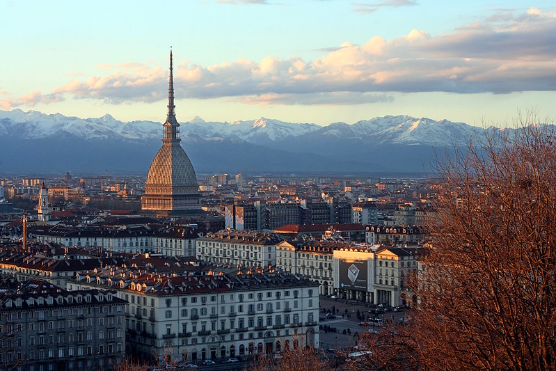

Turin
======
As with our previous events we are happy to organise both our summer school and the following conference in northern Italy. The events take place in Turin, the capital of the Piedmont region with mild and pleasant temperatures in September, ranging from around 14°C in the early morning to 24°C in the afternoon.

Turin by Marit & Toomas Hinnosaar is licensed under CC BY 2.0 Generic on Flickr.com

Scienza Nuova Institute
======
The events will take place at the Scienza Nuova Institute, which is found at Corso Rodolfo Montevecchio, 38, 10129 Torino TO, Italien. Special thanks goes to Prof. Gabriele Gava, University of Turin, to facilitate our stay there.
